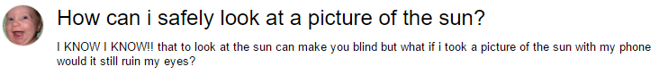
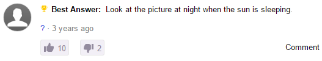
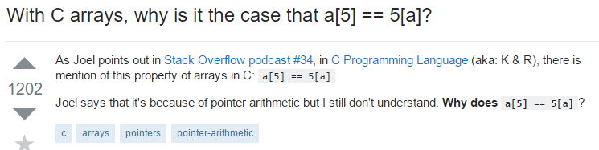

## There are no stupid questions
We've all heard the phrase "There is no such thing as a stupid question." However, when you frequent the web enough and get to see questions like 

you really have to question that statement. Okay, the above example is a little extreme and more likely than not, the person who asked that question was just trying to be funny. Regardless, let's talk about asking dumb questions and what it means as it relates to programming. Before we do so, here is the top answer to that question:

## What (I think) it means
The statement "There is no such thing as a stupid question" isn't meant to be taken literally. Instead, the statement is meant to encourage people to ask more questions and to not be afraid of sounding dumb (which often is not the case anyway). However, although the intention is good and encouraging people to ask questions seems like a good idea, there are some negative aspects to having people freely ask questions. One negative aspect is that people may ask questions without first putting in some effort to research the question. More on this later.

## Asking bad questions
One place where there are a lot of questions (and thus bad ones) is [StackOverflow](http://stackoverflow.com/), an online forum about programming.

## The rules of asking questions
The rules for asking questions on an online forum (yes there are rules) can differ significantly from asking questions in say a classroom setting. For one, teachers are paid to help the students learn whereas members of a forum are there on a voluntary basis. Secondly, it is more understandable for a student to ask a "dumb" question during class, because the teacher may not be available after class ends. On a forum however, people have immediate access to the entirety of the internet with no time restriction.

All that being said, there is a good read on [how to ask questions the smart way](http://www.catb.org/esr/faqs/smart-questions.html) that will discuss some of the intricacies of asking questions on the web and specifically, StackOverflow.

## An example of a bad question

## An example of a good question

