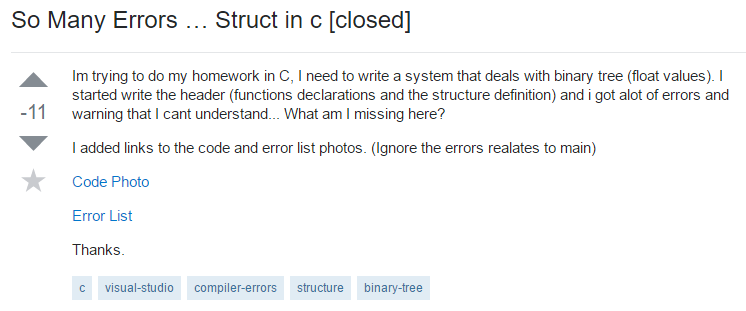

## There are no stupid questions
We've all heard the phrase "There is no such thing as a stupid question." However, when you frequent the web enough and get to see questions like:

you really have to question that statement. Okay, the above example is a little extreme and more likely than not, the person who asked that question was just trying to be funny. Regardless, let's talk about asking dumb questions and what it means as it relates to programming. But before we do so, in case you're curious, here is the top answer to that question:

## What (I think) it means
The statement "There is no such thing as a stupid question" isn't meant to be taken literally. Instead, the statement is meant to encourage people to ask more questions and to not be afraid of sounding dumb (which often is not the case anyway). However, although the intention is good and encouraging people to ask questions seems like a good idea, there are some negative aspects to having people freely ask questions, especially on online forums.

## The rules of asking questions
The rules for asking questions on an online forum (yes there are rules) can differ significantly from asking questions in say a classroom setting. For one, teachers are paid to help the students learn whereas members of a forum are there on a voluntary basis. Secondly, it is more understandable for a student to ask a "dumb" question during class, because the teacher may not be available after class ends. On a forum however, people have immediate access to the entirety of the internet with no time restriction.

## Asking smart questions
The above being said, now the question becomes: "how do we ask smart questions?" To answer that, there is this good read on [how to ask questions the smart way](http://www.catb.org/esr/faqs/smart-questions.html) that will discuss some of the intricacies of asking questions on the web. It mentions one site in particular, [StackOverflow](http://stackoverflow.com/), an online forum about programming.

Here is a question. Determine for yourself if it is a good question or a bad one.

Hint: it's a bad one. According to the article, there are several things wrong with this post.

0. The title is very ambiguous
0. The post is a homework problem
0. The problem statement is very unclear
0. Post has several misspellings
0. Attached code as a picture rather than text

Asking questions in this manner will significantly lower the chances of getting a good response. As mentioned in the article, it may even trigger some sarcastic and condescending responses. Now here is a good question, note the difference.

Here are some of the things about this post:

0. The title describes the problem exactly
0. It is very clear what the question is
0. Includes references to a source

It is very easy to see what exactly the poster is asking and readers can immediately understand the problem. This significantly increases the chance of a good response to this question.

## The takeaway
Simply put, the first step to asking a question should be to first ask Google.