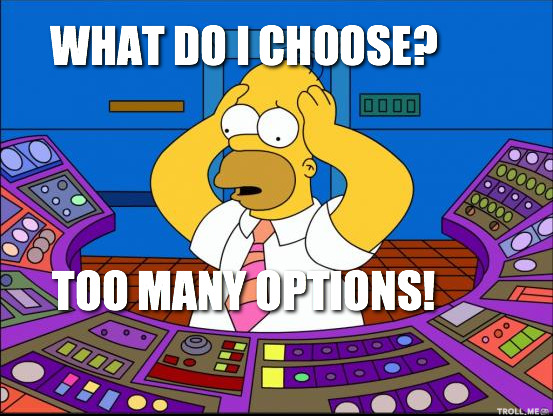

## Previous Experience
Lucky to say, ICS 314 isn't the first time I've laid eyes on JavaScript. It was actually during my co-op tour with AMD that I was tasked to design a webtool and had to learn JavaScript using mostly Google-fu and coding tutorials, but more on that later. Anyway, JavaScript is a language and arguably, the language for the web. Since I'm a computer engineering major, I haven't had any previous exposure to JavaScript from school, so that co-op was really the first time I've seen and used it. So now the question is, what do I think of it?

## What I Like
I started learning JavaScript off of Codecademy and the syntax was pretty similar to some other programming languages that I've used (Python and C). I'd say it was a pretty friendly language to learn and I could see why it was the most popular language. What I really loved about JavaScript was the idea that anyone with a browser could see my projects without having to download or install anything. This gave me a lot of ideas for potential web applications to build. So JavaScript is relatively easy to learn, is the most popular language, and can build cool web applications that run on browsers. What's not to like?

## What I Dislike
Let me preface this next section by saying that I have nothing against frameworks. I know each framework is (hopefully) good for something and that there's a reason to their existence, but my only gripe is that there are so many of them. I'm a person who doesn't fare well when given a lot of options.

I guess it's the sheer number of frameworks available that put me off of learning and actually using them. Who knows, maybe I'll change my mind somewhere down the road.
