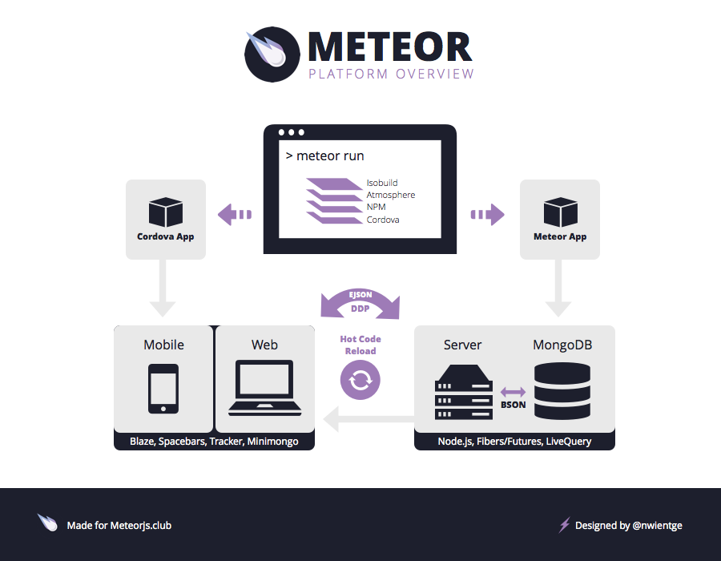

## Initial impressions
My first impression of Meteor was that it was an all-in-one package. Meaning, you learn how to use Meteor, you learn it well, and you have everything you need to start building web applications. I like this because one of my biggest gripes with web development is having to choose what I use. With Meteor, I can focus on just Meteor without having to think about how to integrate something else with it.

Going over the Meteor tutorials, I got my feet wet with working with databases and templates. I was intrigued by how Meteor handles data. Instead of a traditional setup where only the server has access to the database and clients must request the server for data, Meteor sets up a database for the client *and* the server. This means that clients don't have to query the server and then wait for a response, because they have their own local database that they can query and get immediate results from. At this point, I saw the potential with Meteor and I was excited to start using it.

## Steep learning curve
I was surprised at how quickly I went from "Okay, I know what Meteor is doing" to "I have no idea what's going on." In the beginning, we only had to keep track of a few files and we only used fraction of Meteor's capabilities. This made it easy to understand what was happening. However, once we started working on a real project with a real project structure, we were dealing with dozens of different files and even more Meteor stuff. It was pretty overwhelming. I knew that Meteor had a steep learning curve, and at that point, I think I was at the base of it.

I stuck with it and after spending some more hours with Meteor, I became more comfortable with it. I don't think I'm over the hump yet, but I know I'm making progress.

## My future with Meteor
I'm excited to start working on the final project and explore Meteor's capabilities. My only hope is that our project turns out as magnificent as a Meteor.

