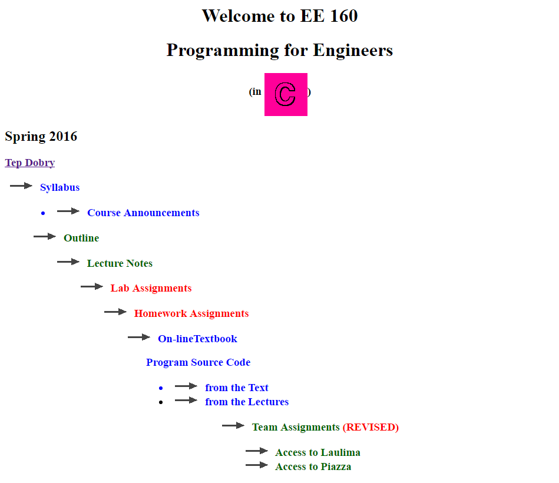

## Intro to the web

About two or three years ago, I wanted to learn web development. I don't remember the reason, but I think it might have had something to do with me wanting to learn new languages. At the time, I knew **nothing** about web development, but after consulting with Google, it seemed like HTML was the way to start.

### Bare HTML
My first steps to learning how to develop for the web involved *just* HTML. I remember creating pages with very square-ish layouts and boxy elements, similar to the websites you'd see back in the early 2000s - as well as the websites for some current faculty members :^).

  

    <i class="hotel icon"></i> Hotel
  

  

I would use inline styles for all my HTML elements, which worked fine for simple layouts. However, when I tried to make more complex layouts, things got **real** messy. It also didn't help that I was using *tables* for my layout (we all did at one point...right?).

### Using CSS
Bare HTML and inline styling was okay, but I thought I'd needed to upgrade.