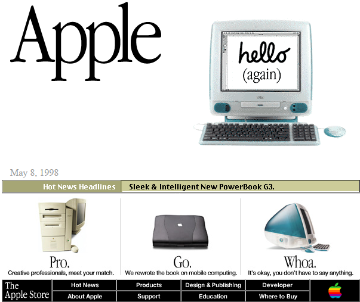
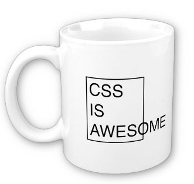

## Intro to the web
About two or three years ago, I wanted to learn web development. I don't remember the reason, but I think it might have had something to do with me wanting to learn new languages. At the time, I knew **nothing** about web development, but after consulting with Google, it seemed like HTML was the way to start.

## Bare HTML
My first steps to learning web development involved *just* HTML. I went through a basic HTML tutorial which gave me enough information to start building simple websites. I remember creating pages with very square-ish layouts and boxy elements, similar to the websites you'd see back in the late 1990s.

  <a href="https://web.archive.org/web/19980509035420/http://www.apple.com/" target="_blank" title="View on WayBack Machine">
    

      Apple's website in the late 1990s
    

    
  </a>

I realized I could've been a web designer at Apple, I was just 20 years too late. Anyway, when creating my bare-HTML websites, I would use inline styles for everything since that was all I knew. This worked fine for simple layouts, but when I tried to make more complex ones, things got **really** messy. It also didn't help that I was using *tables* for my layout (we all did at one point...right?). At that point, I knew I needed an upgrade, and that upgrade was CSS.

## CSS: expectations vs. reality
When I was going through the tutorials for CSS, I thought "Wow, this makes a lot of sense. With a stylesheet, I can separate the styles with the HTML. Also, classes allow me to make my styling modular, instead of having to define one for each element. This is going to make web development much easier." I had a pretty positive outlook on CSS. However, at this point, I was just doing the simple tutorials and had yet to design a nontrivial website.

Fast fkorward about a year (I was busy), I was tasked to build a webpage as part of my internship. Without going into too much detail, the webpage needed to read data from a .csv file, upload the contents into a MySQL database, and display the data in a table. After getting most of the functionality down, I decided to spend some time tweaking the CSS to make it look nice. It didn't take me long to realize that although CSS made it possible to reuse styles for different elements, I still had add the style them line by line. This soon got really complicated as I tried to add more styles and target specific elements. In the end, I was able to finish my webpage and make it look nice. I realized that although CSS is a step up from inline HTML, it was still very unpleasant to work with. Then again, what other options do I have?

## Semantic UI to the rescue
Over these past few days, I got to work with a framework called Semantic UI 