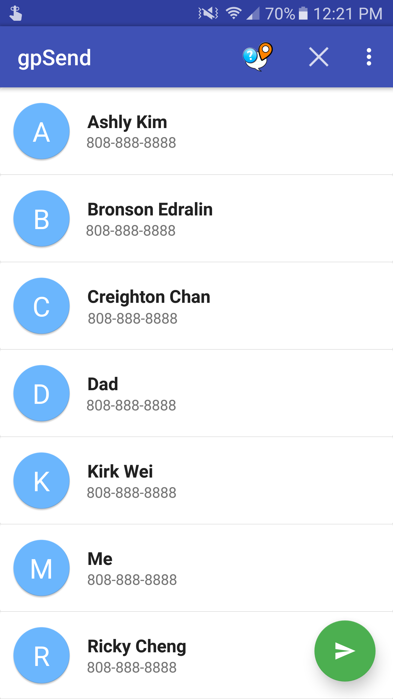

## Introduction
GPSend is a location sharing application that is based off of SMS. It offers two main features: on-demand location sharing and on-request location sharing. On-demand location sharing allows users to select multiple contacts and easily share their location with those contacts. On-request location sharing is a background service that automatically sends the user’s location to someone who requests for it using a specific keyword.

## Motivation
The motivation behind GPSend was to streamline the process of sharing your location without jumping through a series of options and menus. There are a variety of potential applications including safety, coordinating meetups, as well as just finding your misplaced smartphone.

## Competition
There are various other applications out there that accomplish similar tasks. However, it is how those tasks are accomplished that differs GPSend from its competition. For example, Glympse is a popular GPS sharing app that allows users to see where their contacts are on a map. It accomplishes this by sending everyone’s coordinates via data to one of Glympse’s servers, which then creates a map that can be viewed via a web browser. GPSend has several advantages to Glympse. First, it does not require a data plan as it is based off of SMS. Second, your location is only shared with your contacts and not uploaded to a server somewhere.

## Development
GPSend was developed using the Android Studio Development Kit by Google. GitHub was used to host the project and provide source control while it was being developed. In addition to that, we used a variety of online resources relating to Android development and Java programming. The application was tested on my Samsung Galaxy S7 smartphone as well as Creighton’s HTC smartphone.

## My role
In the beginning of development, the tasks were split up into modules. Creighton was responsible for implementing the SMS module, the GPS module, as well as the background service module. I was responsible for designing the UI, storing and updating the contacts, as well as integrating the controls with Creighton’s modules. We worked on implementing these functionalities in separate branches and merged it all together in the end.

## My Experience
This project has taught us a great deal of Android development as well as Java programming. Through the various tutorials, I learned how to create applications, move data back and forth between activities, store data on a phone’s internal storage, as well as learning how to design various layouts. We gained experience with using Git for project management and how to commit and merge changes. Overall, this project has taught us a lot about Android and Java and it was rewarding to complete our application.