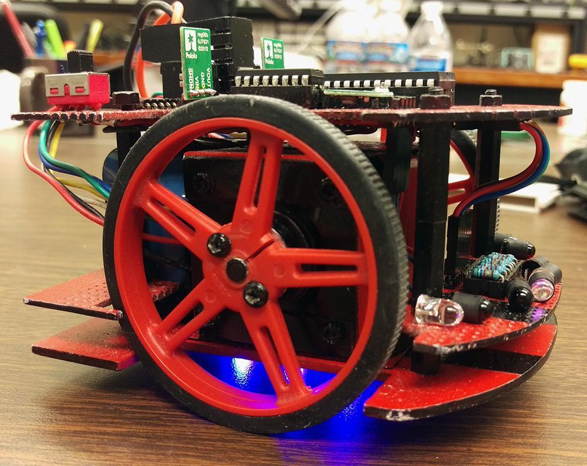

## Introduction
Micromouse is an internationally recognized competition where robot "mice" race to solve a 16x16 cell maze in the shortest time possible. Events are held worldwide and at varying levels. At the very top is the international competition where the mice go so fast that it becomes a task just to keep up with their movement (imagine <6 second solves). Unfortunately, our mouse was not fast enough to compete at this level. Instead, it competed at the collegiate level with mice from other [IEEE Region 6 schools](http://ieee-region6.org/).

## Rules
Although the rules may differ slightly depending on the region and level of competition, here are the basics:

0. The mouse must navigate the maze autonomously, meaning there must be no help from the contestant.
0. The time for a run starts when the mouse leaves the start cell and stops when the mouse enters the center. Upon reaching the center, the mouse must return back to the start cell in order to perform another run.
0. Contestants may perform as many runs as he/she can fit within a certain time limit (typically 10 minutes).
0. If contestants touch the mouse before it makes it back to the start cell, then a penalty shall be assessed (typically an additional 30 seconds to the best run time).
You can read the full rules at the [Micromouse USA website](http://micromouseusa.com/wp-content/uploads/2016/04/AAMC2016Rules.pdf).

## My Role
I took on this project with three of my classmates as our sophomore engineering design project. When deciding how we were going to split up the roles, we split our team into halves, the hardware half and the software half. I was the lead for the software half and so my responsibilities was to work with my other software teammate to write drivers for the various components for the mouse. This included stepping the stepper motors, displaying the LEDs, and the overall maze solving algorithm. Aside from the technical role, I was also chosen (because no one else wanted to) to be the overall team lead. My responsibilities for the team lead was to coordinate team meetings and be the main point of contact between our team and our project advisor.

## The Looks

It all started when my partner Creighton ordered these huge red wheels with black tires. They didn't match the color scheme of our mouse, which was then just stock parts put together, so I decided it would be a good idea to spray paint everything to give it some flare. Now, if I had known how much work was involved with making it look the way it does, I might've reconsiderd. However, the waking up at 30-minute intervals at 4 AM to apply layers of paint on the circuit board, motors, and even the screws, really did pay off (at least in my head).

## My Experience
If I could name one project as being the most influential, it would be Micromouse. This is true as of Jan. 2017 and I think it will remain true for a good amount of time longer. Micromouse was my very first technical project and I learned a ton from it. Skills such as embedded programming, circuit design, soldering, were just some of the things that I took away from this project. I think what's more important is how rewarding it was to see all our hard work and sleepless nights pay off.

## The Underglow
Before I left for Texas in 2016, I wanted to install some underglow on the bottom. We had some RGB LED strips leftover from another project and I saw the opportunity. The RGB LED strip had a GND pin and three power pins, one for each color (red, green, blue). However, the only problem was the power pins required 12V when our board only supplied 5V and 3.3V. However, with some careful maneuvers, I was able to solder on a 12V voltage regulator to power the RGB strip and the result is epic. It looks even better in the dark.

## Videos
If you want to see our mouse in action, you can check out [my YouTube playlist](https://www.youtube.com/watch?v=hF58yFzQRJ8&list=PL9FNoqJdsAE-hACMQq3EWkxfHnZDU13_g).