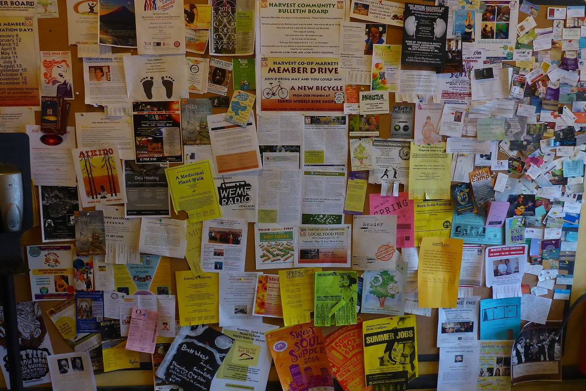
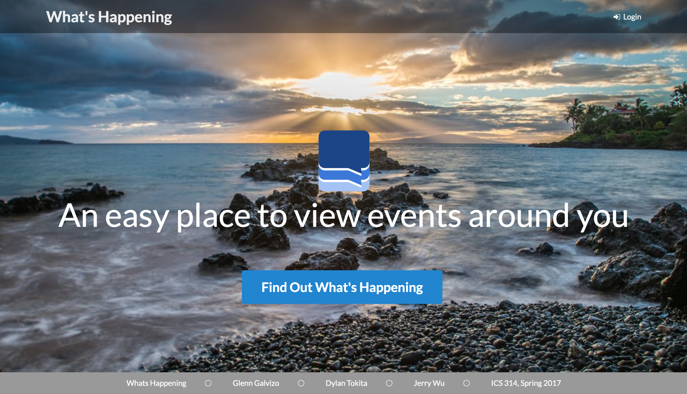
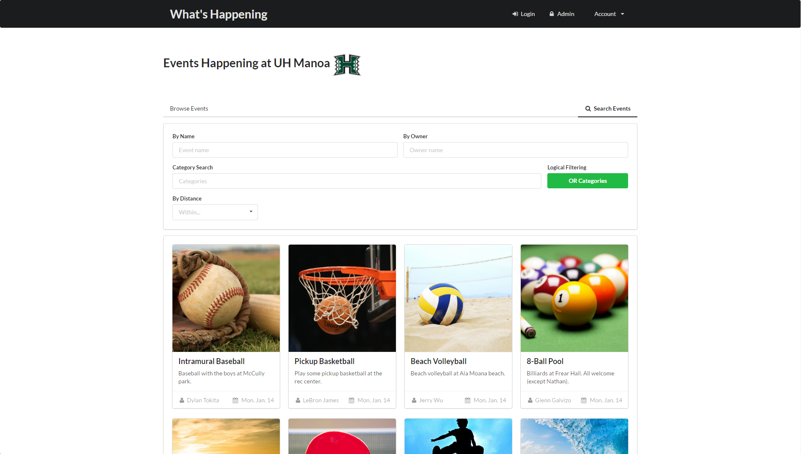

## Motivation
For college students, finding events can be hard. Finding events that you're actually interested in, can be even harder. Here's an example.

Try finding the flier for the film festival. It's not very obvious, is it?

The same goes for those looking to advertise their events. Having to compete against all the other fliers makes it a less-than-ideal situation for getting your event publicity.

## Introduction

What's Happening is a web application designed to solve the problems mentioned above. It aims to be a one-stop-shop for those looking to create an event and advertise it, or for those looking to find interesting events to attend.

Above is the home page. The events are listed as cards, which users can click to bring up a more detailed view. Users have the ability to attend events, save events, and create events. On their profile page, users can view the events they have saved, are planning to attend, or own.

## My experience
The goals of this project were (if I remember them correctly):

  * Practice using Git on a medium-sized software project involving multiple members
  * Gain experience developing with MeteorJS and SemanticUI
  * Practice issue-driven development with GitHub's project management tool

Now, looking back on these goals, I'd say that our team was successful in all three areas.

We got a lot better with using Git and our usage of `rm -rf` and then `git clone` significantly dropped. Even though I had previous experience developing with Git, I learned a lot about using Git in a team environment, and to develop in a separate branch and then merge back into master.

Our efforts with MeteorJS and SemanticUI turned out pretty well (at least I think so). We created an aesthetically pleasing and functional web application that accomplished the original goals of the project--to have users view and create events. I worked on integrating the profile page with the collections and implementing the animations to switch between a user's own events, saved events, and attending events. I also worked on implementing the modals (the popups that appear when a card is clicked) as well as the ability to save and attend an event.

The issue-driven development scheme we followed was effective in getting us to get things done. We were able to see what needed to be done and we were able to delegate the tasks effectively. Another good thing about issue-driven development is that I don't have to think of a descriptive yet brief name for my branches (branch names are just the issue number).

Overall, this project was a success and I had a fun time working on it. I learned a lot about working with a team on a relatively large software projects and collaboration tools such as Slack, Git, and GitHub.

## Read more and contribute!
If you want to read more about our page, check out our [GitHub page](https://whats-happening-uhm.github.io/) and our [GitHub repo](https://github.com/whats-happening-uhm/whats-happening-uhm).

Also, check out the other developers of this project: [Dylan Tokita](https://dtokita.github.io/) and [Glenn Galvizo](https://glennga.github.io/).
